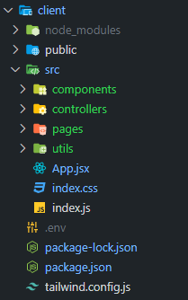

<h1 align="center"><strong>👨‍🎓 NKSS 👩‍🎓</strong></h1>

<div align="start">

## Folder structure
Frontend --> Client
Backend --> Backend

##### Client
Client's folder structure is similar to react folder structure. Main director is `src`. 

    src
        components (contains react components)
        controllers (contains all classes and functions)
        pages (contains all pages files)
        utils (contains utility functions or constants)
        App.jsx (Root file)
        index.css (Stylesheet)
        Index.js (Entry Point)



###### Create a .env filer in the client directory and paste the following
```
REACT_APP_GOOGLE_CID=1068529013155-7fgh84mf7umu0j3abqfd2kl2kjj18snb.apps.googleusercontent.com
REACT_APP_API_URL=http://localhost:5000
```


</div>